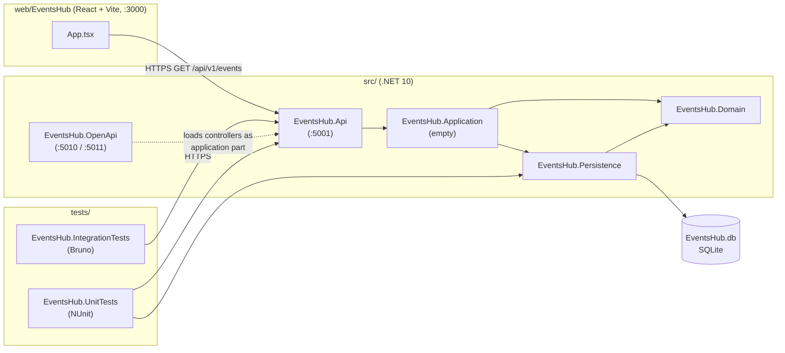
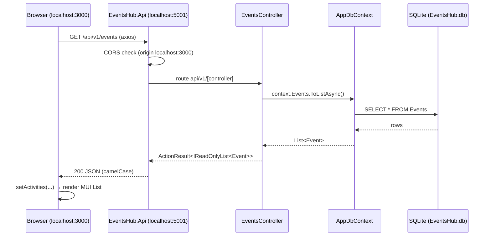
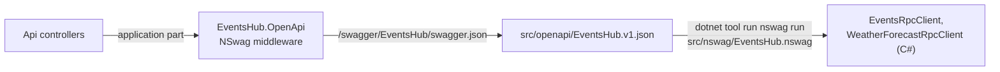

# EventsHub Architecture

## 1. Overview

EventsHub is a small events catalogue built as a course project (ICI 2026 01). It consists of:

- A **REST API** (ASP.NET Core, .NET 10) that serves events stored in a local **SQLite** database through **Entity Framework Core**.
- A **web frontend** (React 19 + Vite + MUI) that lists those events.
- A **standalone OpenAPI host** used only to produce the API's OpenAPI document and a generated C# client via NSwag.
- **Unit tests** (NUnit) and **API integration tests** (a Bruno collection).

Current functional scope is read-only: list all events and fetch one event by id. There is no create/update/delete, authentication, or validation yet.

## 2. Component map

Solid arrows between .NET projects are project references. The Api reaches `Persistence` and `Domain` only transitively through `Application`.

| Component                                              | Role                                                  | README                                                  |
| ------------------------------------------------------ | ----------------------------------------------------- | ------------------------------------------------------- |
| `src/EventsHub.Domain`                                 | Entity classes (`Event`)                              | [README](../src/EventsHub.Domain/README.md)             |
| `src/EventsHub.Persistence`                            | `AppDbContext`, migrations, seed data                 | [README](../src/EventsHub.Persistence/README.md)        |
| `src/EventsHub.Application`                            | Reserved for application logic; currently has no code | [README](../src/EventsHub.Application/README.md)        |
| `src/EventsHub.Api`                                    | HTTP API, startup, CORS                               | [README](../src/EventsHub.Api/README.md)                |
| `src/EventsHub.OpenApi` (+ `src/nswag`, `src/openapi`) | OpenAPI document and C# client generation             | [README](../src/EventsHub.OpenApi/README.md)            |
| `web/EventsHub`                                        | React frontend                                        | [README](../web/EventsHub/README.md)                    |
| `tests/EventsHub.UnitTests`                            | NUnit tests for controllers                           | [README](../tests/EventsHub.UnitTests/README.md)        |
| `tests/EventsHub.IntegrationTests`                     | Bruno HTTP collection                                 | [README](../tests/EventsHub.IntegrationTests/README.md) |

## 3. Request flow: loading the event list

`GET /api/v1/events/{id}` follows the same path using `context.Events.FindAsync(id)`, and returns `404` with the plain-text body `"The event was not found"` when there is no match.

## 4. API startup

On every start, `src/EventsHub.Api/Program.cs`:

1. Registers controllers, `AppDbContext` (SQLite, connection string `SqliteConnection` = `Data Source=EventsHub.db`) and CORS.
2. Allows CORS from `http://localhost:3000` and `https://localhost:3000` only, with any header and method.
3. Applies pending EF Core migrations (`Database.MigrateAsync()`).
4. Seeds 10 sample events (5 past, 5 future) with `DbInitializer.SeedDataAsync`, but only if the `Events` table is empty.
5. Maps controllers and runs on `https://localhost:5001`.

Migration or seed failures are logged and do not stop the API from starting.

The SQLite path is relative, so the database file is created in the process's working directory. With `dotnet run --project src/EventsHub.Api`, that is `src/EventsHub.Api/`. `*.db` files are git-ignored.

## 5. OpenAPI and client generation pipeline

The API itself does not serve Swagger. A separate host does:

The generated client and JSON are checked in and must not be hand-edited. Step-by-step instructions are in the [OpenApi README](../src/EventsHub.OpenApi/README.md), with background in [OpenApi 1.md](OpenApi%201.md).

## 6. Key architectural decisions

- **Layered by project, not by behavior.** The solution is split into Domain → Persistence → Application → Api projects, but the layering is structural only. `EventsHub.Application` holds no code, and controllers inject `AppDbContext` directly (no services, repositories, DTOs or mapping). Domain entities are returned to clients as-is.
- **SQLite file database.** No database server is required. Schema is managed with EF Core code-first migrations that are applied automatically on startup.
- **Separate documentation host.** Swagger/NSwag lives in `EventsHub.OpenApi`, keeping NSwag and Newtonsoft.Json out of the production API. The host configures Newtonsoft with camelCase so the document matches the API's `System.Text.Json` output.
- **URL-based versioning.** All controllers inherit `EventsHubBaseController`, which applies `[ApiController]` and the route `api/v1/[controller]`.
- **Real database in unit tests.** Unit tests run against a real SQLite file, migrated and seeded once per test run, rather than an in-memory provider or mocks.

## 7. Cross-cutting conventions

- **Routing:** new controllers inherit `EventsHubBaseController`; action methods are `async` and suffixed `Async` (e.g. `GetEventsAsync`).
- **Identifiers:** entity ids are `string` GUIDs generated in the entity's property initializer.
- **JSON:** camelCase property names on the wire. The frontend's types mirror this.
- **Error handling:** none centralised. Controllers return `NotFound(...)` with a string message; unhandled exceptions use ASP.NET Core defaults.
- **Auth:** none.
- **Tests:** named `Method_WhenCondition_ExpectedResult`, with `// Arrange`, `// Act`, `// Assert` sections.
- **Git:** work is done on assignment branches (`parcial01`, `parcial02`) alongside `develop` and `main`. Commit messages use `feat(<branch>) - <description>`.

## 8. Current state and known inconsistencies

These are deliberate notes about the code as it is today, not a target design:

1. **Frontend and backend models diverge.** The frontend calls the entity `Activity` (`web/EventsHub/src/lib/types/index.d.ts`) and types `latitude`/`longitude` as `number`. The backend `Event` has them as `string`.
2. **Hard-coded API URL.** `App.tsx` calls `https://localhost:5001/api/v1/events` directly. There is no environment-based configuration or shared API client.
3. **`axios` lives outside the Vite project.** It is declared in `web/package.json` rather than `web/EventsHub/package.json` and resolves from the parent `node_modules`.
4. **Generated client location.** The NSwag `output` path is resolved relative to `src/nswag/`, so the client is written to `src/src/EventsHub.OpenApi/Generated/`. No project compiles or consumes it.
5. **The OpenAPI host does not register `AppDbContext`.** This is enough to generate the document, but calling an `Events` endpoint from its Swagger UI fails because the controller can't be constructed.
6. **Template leftovers.** `WeatherForecastController` and `WeatherForecast` from the ASP.NET template are still exposed and appear in the OpenAPI document, generated client and Bruno collection.
7. **Brittle integration test.** `Events - Get - 200` uses a fixed event id. Seeded ids are random GUIDs, so it only passes against the database it was recorded with.
8. **Shared test state.** All unit tests share one `AppDbContext` and one SQLite file in the test output folder. Tests that write data would affect each other.
